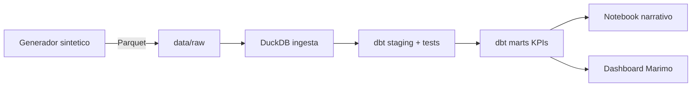
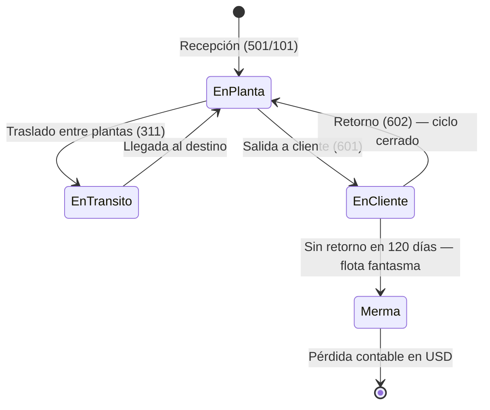
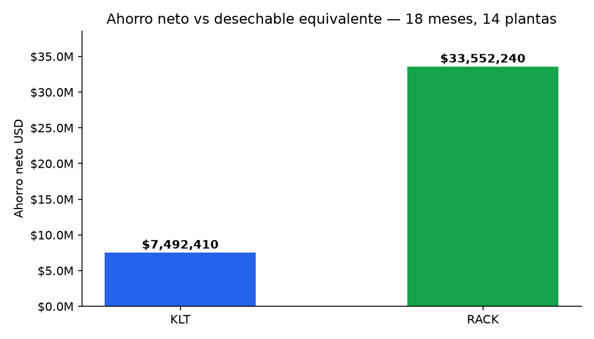

# returnable-packaging-intelligence


Análisis de rotación, ciclo y pérdidas de contenedores retornables en flota multi-planta usando datos MB51 sintéticos. Modela el comportamiento real de una operación de Returnable Packaging Logistics (RPL) automotriz: 14 plantas entre México, Estados Unidos y Nicaragua, ~1,200 SKUs de empaque, 18 meses de historia, ~10M movimientos.

El objetivo es aterrizar en KPIs accionables para un equipo de gobernanza de RPL: cuánto se pierde en USD, en qué rutas cliente se pierde primero, qué SKUs pasan de "activos" a "flota fantasma", y qué tan disciplinado es el registro operativo comparado con la fecha real del movimiento.

## Disclaimer

Todos los datos de este repositorio son **sintéticos**. Se generan por código a partir de reglas de negocio publicadas en `PROYECTO.md`. No provienen de ningún sistema SAP productivo, ni de datos anonimizados de ningún empleador pasado o presente. El generador vive en `src/rpi/` y es 100% reproducible con `uv sync` + un comando. 

El período del dataset cubre 18 meses hacia atrás desde la fecha de generación. Los movimientos de retorno (Bwart 602) pueden extenderse algunos meses más allá de esa ventana, dado que el ciclo 601→602 es log-normal con cola de hasta 180 días.

## Problema

Los suppliers Tier-1 de industria automotriz manejan flotas de contenedores retornables (racks metálicos, KLTs plásticos) que ciclan entre planta y cliente. La tasa típica de pérdida anual está entre 2% y 5%. En una flota mediana eso son cientos de miles de dólares que se registran como activos en SAP pero que en la práctica ya no vuelven.

MB51 registra cada movimiento (clase 501, 601, 311, etc.) pero por sí solo no responde:

- ¿Cuántos días tarda en promedio un empaque en volver de cliente? (ciclo 601→602)
- ¿Qué rutas cliente concentran las pérdidas?
- ¿Qué SKUs cruzaron un umbral que sugiere pérdida no reconocida?
- ¿La disciplina de registro varía por planta? (lag Cpudt vs Budat)

Este proyecto construye el pipeline analítico que sí responde esas preguntas.

## Approach

Batch, no streaming. Pipeline reproducible corrido localmente sin infraestructura cloud.



Grafo de linaje generado por dbt:


Ciclo de vida de un contenedor retornable en la red:



El generador produce los movimientos MB51 con reglas realistas: mix por tipo de empaque, ciclo log-normal 601→602 con cola larga, tasa de no-retorno del 2% distribuida entre rutas, lag Cpudt/Budat con distribución 92/6/2. Los parámetros están documentados en `PROYECTO.md` sección 4.

## Stack

Elegí este stack apuntando a un pipeline analítico reproducible sin depender de infraestructura administrada. Los ADRs con contexto y alternativas descartadas están en `PROYECTO.md` sección 3.

| Capa | Herramienta | Por qué |
|------|-------------|---------|
| DataFrames | Polars | 5-10x más rápido que Pandas a 10M filas. Sintaxis moderna. |
| Warehouse local | DuckDB | Motor OLAP embebido. Cero infraestructura. |
| Modelado analítico | dbt-duckdb | Linaje, tests y docs auto-generados. |
| Validación de schemas | Pandera | Contrato explícito sobre las 22 columnas MB51. |
| Generación sintética | NumPy + Faker | Distribuciones realistas por parámetro. |
| Persistencia | Parquet | Columnar comprimido, interoperable. |
| Package manager | uv | Setup en segundos. Reemplaza pip + venv + poetry. |
| Lint + format | Ruff | Rápido, opinado, un solo binario. |
| Tests | pytest + pytest-cov | Estándar. |
| CI | GitHub Actions | Tests y lint en cada push. |
| Dashboard | Marimo | Notebook reactivo en `.py` plano: diffs legibles en Git, corre como app. |

Explícitamente descartado: Pandas, Airflow, Postgres, Snowflake. Ver ADRs para el razonamiento.

## Requisitos

- Python 3.11 o superior.
- [uv](https://github.com/astral-sh/uv) instalado.
- Git.

## Reproducir el pipeline completo

Clonar y levantar el entorno:

```bash
git clone https://github.com/juancarlospradologistica-hub/returnable-packaging-intelligence.git
cd returnable-packaging-intelligence
uv sync
```

Generar el dataset sintético (18 meses, 14 plantas, ~10M movimientos):

```bash
uv run python -c "
from rpi.generator import generate
generate()
"
```

Ingestar a DuckDB:

```bash
uv run python -c "from rpi.db import ingest; ingest()"
```
> Si generaste el dataset con `--output` en un directorio distinto a `data/raw`, pasa el argumento correspondiente: `from rpi.db import ingest; ingest(raw_dir="data/custom")`.

Correr los modelos dbt:

```bash
uv run dbt run --profiles-dir .
```

Correr los tests:

```bash
uv run pytest tests/ -v
```

Abrir el dashboard:

```bash
uv run marimo run notebooks/02_dashboard.py
```

## Estructura del repo

```
returnable-packaging-intelligence/
├── .github/workflows/
│   └── ci.yml                  # lint + generador CI + dbt + pytest en cada push
├── data/
│   └── raw/                    # Parquet generado (excluido de Git)
├── docs/
│   └── img/                    # Imágenes para notebooks
├── models/
│   ├── staging/
│   │   ├── sources.yml
│   │   └── stg_mb51.sql
│   ├── intermediate/
│   │   ├── int_ciclo_retorno.sql
│   │   └── int_tco_por_material.sql
│   └── marts/
│       ├── mart_perdidas_usd.sql
│       ├── mart_rotacion_planta.sql
│       ├── mart_rutas_rotas.sql
│       └── mart_tco_comparativo.sql
├── notebooks/
│   ├── 00_sanity_check.ipynb
│   ├── 01_analisis_perdidas.ipynb
│   ├── 02_dashboard.py         # Dashboard Marimo
│   └── 03_tco_analysis.ipynb
├── src/rpi/
│   ├── config.py               # Parámetros del generador (Pydantic)
│   ├── db.py                   # Ingesta Parquet → DuckDB
│   ├── generator.py            # Generador sintético MB51
│   └── schema.py               # Schema Pandera 22 columnas
├── tests/
│   ├── conftest.py
│   ├── test_generator.py
│   ├── test_marts.py
│   └── test_schema.py
├── dbt_project.yml
├── profiles.yml                # DuckDB con rutas relativas para CI
├── pyproject.toml
└── README.md
```

## Resultados Fase 1: rotación y pérdidas

Dataset sintético de 18 meses, 14 plantas (MX / US / NI), ~15.5 M movimientos MB51.

| KPI | Valor |
|-----|-------|
| Pérdida acumulada | $4,822,074 USD |
| Unidades sin retorno | 72,512 |
| Costo promedio por unidad perdida | $66.50 USD |
| Plantas analizadas | 14 |
| Tipo de contenedor con mayor impacto | Rack metálico ($180 USD/unidad) |
| Ruta con mayor pérdida acumulada | PLNT_MX01 → CUST-5144 |
| Tasa de merma máxima por ruta | 35.29% |

Cada punto porcentual de mejora en la tasa de retorno vale ~$48,000 USD anuales sobre esta flota.

Los racks metálicos concentran el impacto financiero aunque los KLTs plásticos superan en volumen de pérdidas. Perder un rack equivale a perder 7 KLTs.

El análisis completo está en `notebooks/01_analisis_perdidas.ipynb`.

## Resultados Fase 2: TCO retornable vs desechable

La pregunta de Fase 2: con amortización, mantenimiento y merma incluidos, ¿sigue saliendo más barato operar con retornables que reemplazarlos por empaque de un solo uso?

El ahorro neto de la flota retornable contra desechable es **$41.0M USD** en 18 meses.

| Tipo | Ciclos | Ahorro neto (USD) | Ahorro neto / ciclo | Payback | Merma / ahorro bruto |
|---|---:|---:|---:|---:|---:|
| Rack | 923,918 | 33,552,240 | $36.32 | 5 ciclos | 9.8% |
| KLT | 2,085,975 | 7,492,410 | $3.59 | 6 ciclos | 13.1% |
| Cartón | 325,534 | n/a | n/a | n/a | línea base |



Observaciones:

- El rack corre menos de la mitad de ciclos que el KLT y genera 4.5x su ahorro. Si hay que priorizar dónde poner control de flota, empiezo por racks.
- La tasa de no-retorno es la misma para todos los tipos, pero pega más en el KLT. Su margen por ciclo contra el desechable es delgado, así que cada pieza perdida se come una fracción mayor del ahorro.
- Los dos retornables recuperan su costo en 5-6 ciclos. Con un ciclo de ~25 días, son unos 5 meses de operación.
- La merma que resta el TCO ($4.8M) cuadra con la pérdida total de Fase 1. Los dos marts leen de `int_ciclo_retorno`, así que sirve como validación cruzada.

Cartón aparece como línea base: contra sí mismo no tiene ahorro ni payback. En el mart su ahorro neto sale en -$57,064, que es exactamente su costo de merma.

### Supuestos

| Parámetro | KLT | Rack | Cartón |
|---|---:|---:|---:|
| Costo unitario (USD) | 25.00 | 180.00 | 8.00 |
| Vida útil (ciclos) | 150 | 80 | 1 |
| Mantenimiento por ciclo (USD) | 0.20 | 2.50 | 0.00 |
| Desechable equivalente (USD) | 4.50 | 45.00 | 8.00 |

Los parámetros viven en `models/intermediate/int_tco_por_material.sql`.

### Desechable equivalente del rack

Un rack metálico no tiene sustituto desechable directo. Para compararlo armé el empaque de un solo uso que haría el mismo trabajo en un embarque:

| Componente | Rango de mercado (USD) | Usado |
|---|---:|---:|
| Caja corrugada triple pared (bulk bin) | 18–30 | 22 |
| Tarima de madera de un solo uso | 10–20 | 12 |
| Dunnage interior (separadores, espuma) | 5–12 | 8 |
| Consumibles (película stretch, fleje, etiquetas) | 1–4 | 3 |
| **Total** | **34–66** | **45** |

Son rangos de orden de magnitud, no cotizaciones: cambian por región, volumen y tamaño de pieza. Asumo que una carga de rack equivale a un embarque desechable.

Es el supuesto que más mueve el resultado. Cada dólar arriba o abajo cambia el ahorro del rack en ~$0.9M. Con el rango completo, el ahorro total va de ~$31M a ~$60M. Con la merma actual, el rack deja de convenir solo si el desechable baja de ~$8.70.

Payback, sensibilidad a la tasa de merma y resumen ejecutivo en `notebooks/03_tco_analysis.ipynb`. El dashboard Marimo tiene una pestaña TCO con el detalle por planta.

## Estado

Fase 1 (rotación y pérdidas) y Fase 2 (TCO retornable vs desechable) cerradas. Pipeline de punta a punta: generador sintético → DuckDB → 7 modelos dbt → notebooks → dashboard Marimo con dos pestañas.

Roadmap completo por semanas en `PROYECTO.md` sección 5.

## Licencia

MIT. Ver `LICENSE`.