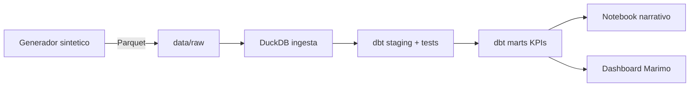
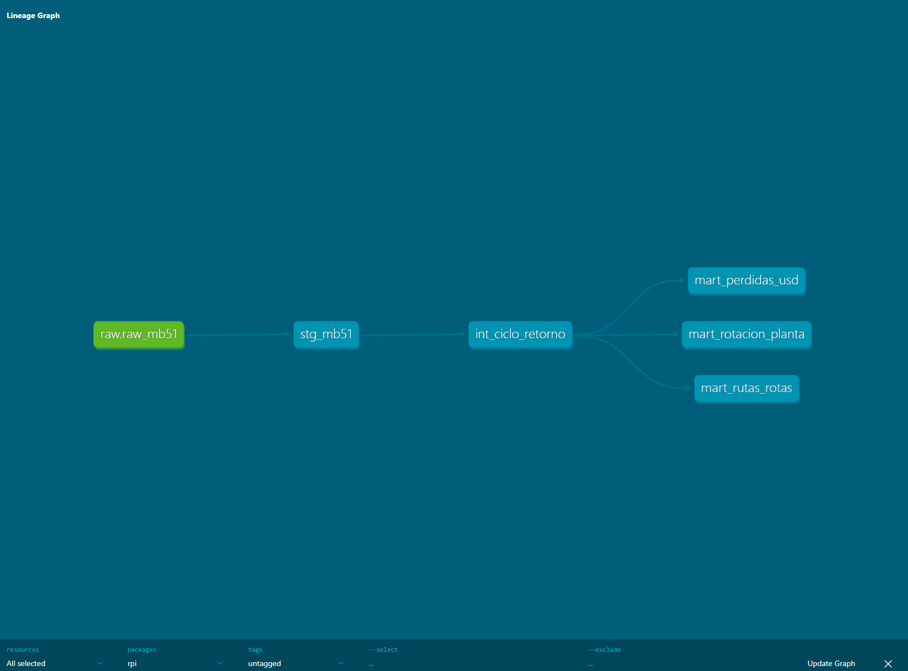

# returnable-packaging-intelligence


Análisis de rotación, ciclo y pérdidas de contenedores retornables en flota multi-planta usando datos MB51 sintéticos. Modela el comportamiento real de una operación de Returnable Packaging Logistics (RPL) automotriz: 14 plantas entre México, Estados Unidos y Nicaragua, ~1,200 SKUs de empaque, 18 meses de historia, ~10M movimientos.

El objetivo es aterrizar en KPIs accionables para un equipo de gobernanza de RPL: cuánto se pierde en USD, en qué rutas cliente se pierde primero, qué SKUs pasan de "activos" a "flota fantasma", y qué tan disciplinado es el registro operativo comparado con la fecha real del movimiento.

## Disclaimer

Todos los datos de este repositorio son **sintéticos**. Se generan por código a partir de reglas de negocio publicadas en `PROYECTO.md`. No provienen de ningún sistema SAP productivo, ni de datos anonimizados de ningún empleador pasado o presente. El generador vive en `src/rpi/` y es 100% reproducible con `uv sync` + un comando.

## Problema

Los suppliers Tier-1 de industria automotriz manejan flotas de contenedores retornables (racks metálicos, KLTs plásticos) que ciclan entre planta y cliente. La tasa típica de pérdida anual está entre 2% y 5%. En una flota mediana eso son cientos de miles de dólares que se registran como activos en SAP pero que en la práctica ya no vuelven.

MB51 registra cada movimiento (clase 501, 601, 311, etc.) pero por sí solo no responde:

- ¿Cuántos días tarda en promedio un empaque en volver de cliente? (ciclo 601→602)
- ¿Qué rutas cliente concentran las pérdidas?
- ¿Qué SKUs cruzaron un umbral que sugiere pérdida no reconocida?
- ¿La disciplina de registro varía por planta? (lag Cpudt vs Budat)

Este proyecto construye el pipeline analítico que sí responde esas preguntas.

## Approach

Batch, no streaming. Pipeline reproducible corrido localmente sin infraestructura cloud.



Grafo de linaje generado por dbt:



El generador produce los movimientos MB51 con reglas realistas: mix por tipo de empaque, ciclo log-normal 601→602 con cola larga, tasa de no-retorno del 2% distribuida entre rutas, lag Cpudt/Budat con distribución 92/6/2. Los parámetros están documentados en `PROYECTO.md` sección 4.

## Stack

Elegí este stack apuntando a un pipeline analítico reproducible sin depender de infraestructura administrada. Los ADRs con contexto y alternativas descartadas están en `PROYECTO.md` sección 3.

| Capa | Herramienta | Por qué |
|------|-------------|---------|
| DataFrames | Polars | 5-10x más rápido que Pandas a 10M filas. Sintaxis moderna. |
| Warehouse local | DuckDB | Motor OLAP embebido. Cero infraestructura. |
| Modelado analítico | dbt-duckdb | Linaje, tests y docs auto-generados. |
| Validación de schemas | Pandera | Contrato explícito sobre las 22 columnas MB51. |
| Generación sintética | NumPy + Faker | Distribuciones realistas por parámetro. |
| Persistencia | Parquet | Columnar comprimido, interoperable. |
| Package manager | uv | Setup en segundos. Reemplaza pip + venv + poetry. |
| Lint + format | Ruff | Rápido, opinado, un solo binario. |
| Tests | pytest + pytest-cov | Estándar. |
| CI | GitHub Actions | Tests y lint en cada push. |

Explícitamente descartado: Pandas, Airflow, Postgres, Snowflake. Ver ADRs para el razonamiento.

## Requisitos

- Python 3.11 o superior.
- [uv](https://github.com/astral-sh/uv) instalado.
- Git.

## Reproducir el pipeline completo

Clonar y levantar el entorno:

```bash
git clone https://github.com/juancarlospradologistica-hub/returnable-packaging-intelligence.git
cd returnable-packaging-intelligence
uv sync
```

Generar el dataset sintético (18 meses, 14 plantas, ~10M movimientos):

```bash
uv run python -c "
from rpi.generator import generate
generate()
"
```

Ingestar a DuckDB:

```bash
uv run python -c "from rpi.db import ingest; ingest()"
```

Correr los modelos dbt:

```bash
uv run dbt run --profiles-dir .
```

Correr los tests:

```bash
uv run pytest tests/ -v
```

Abrir el dashboard:

```bash
uv run marimo run notebooks/02_dashboard.py
```

## Estructura del repo

```
returnable-packaging-intelligence/
├── .github/workflows/
│   └── ci.yml                  # lint + generador CI + dbt + pytest en cada push
├── data/
│   └── raw/                    # Parquet generado (excluido de Git)
├── docs/
│   └── img/                    # Imágenes para notebooks
├── models/
│   ├── staging/
│   │   ├── sources.yml
│   │   └── stg_mb51.sql
│   ├── intermediate/
│   │   └── int_ciclo_retorno.sql
│   └── marts/
│       ├── mart_perdidas_usd.sql
│       ├── mart_rotacion_planta.sql
│       └── mart_rutas_rotas.sql
├── notebooks/
│   ├── 00_sanity_check.ipynb
│   ├── 01_analisis_perdidas.ipynb
│   └── 02_dashboard.py         # Dashboard Marimo
├── src/rpi/
│   ├── config.py               # Parámetros del generador (Pydantic)
│   ├── db.py                   # Ingesta Parquet → DuckDB
│   ├── generator.py            # Generador sintético MB51
│   └── schema.py               # Schema Pandera 22 columnas
├── tests/
│   ├── conftest.py
│   ├── test_generator.py
│   └── test_schema.py
├── dbt_project.yml
├── profiles.yml                # DuckDB con rutas relativas para CI
├── pyproject.toml
└── README.md
```


## Estado

Pipeline completo funcionando de punta a punta: generador sintético → DuckDB → dbt marts → dashboard Marimo con KPIs de rotación, pérdidas en USD, rutas rotas y ciclo de retorno 601→602.

Roadmap completo por semanas en `PROYECTO.md` sección 5.

## Licencia

MIT. Ver `LICENSE`.