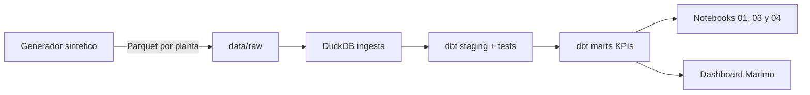
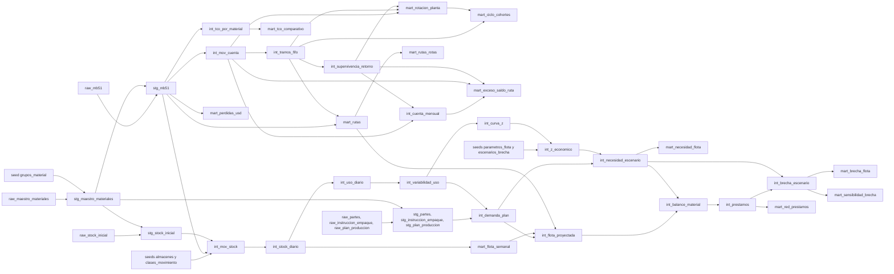
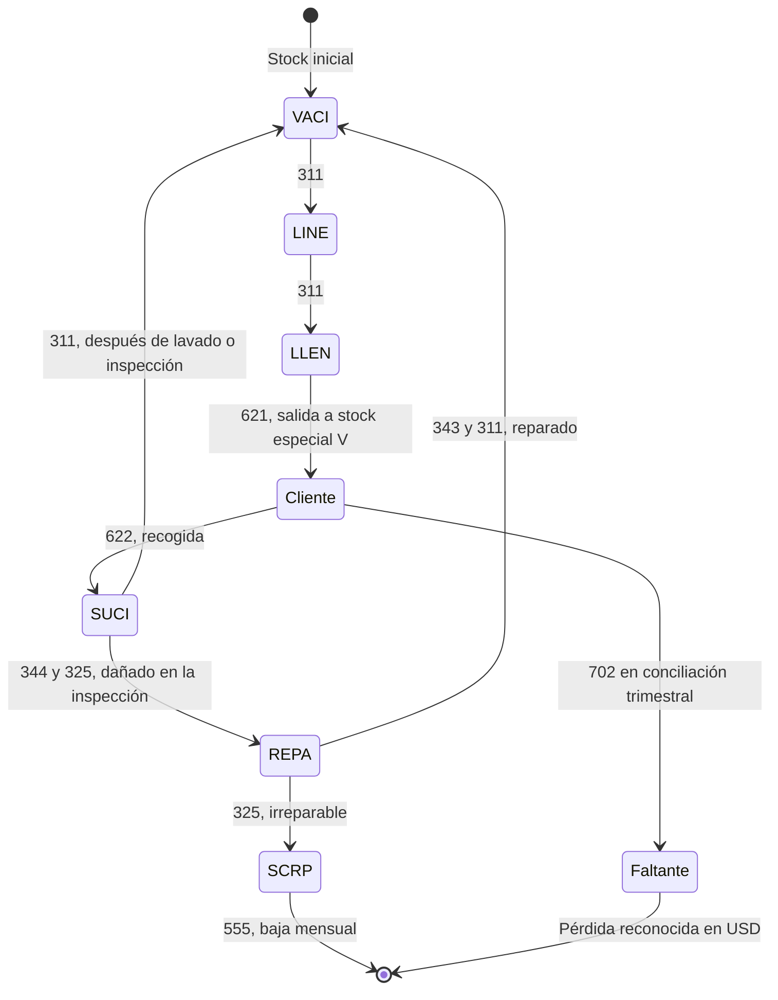
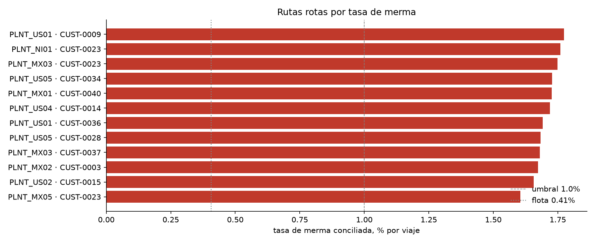
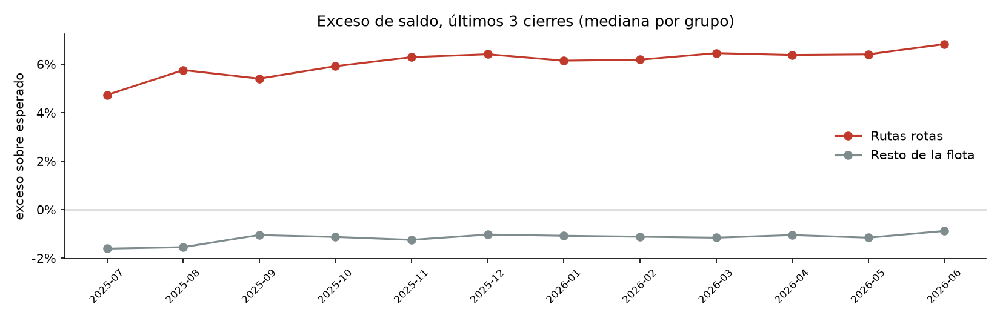
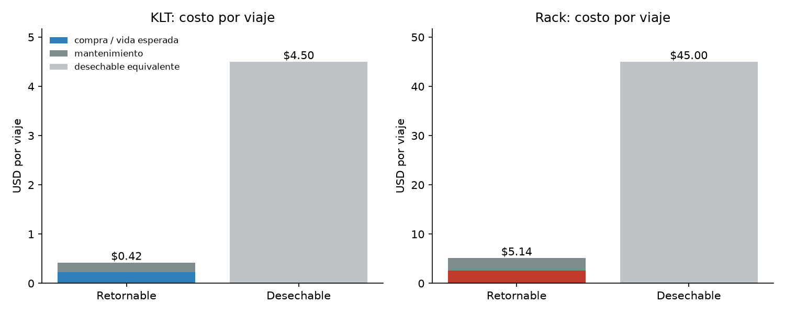
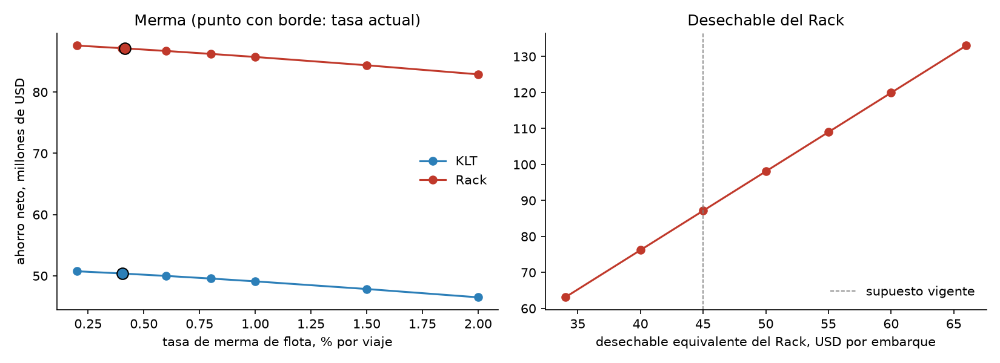
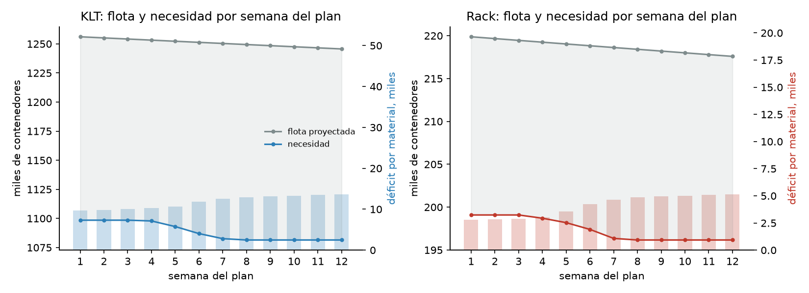
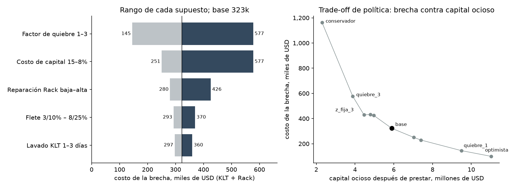

# returnable-packaging-intelligence


Análisis de ciclo, saldo en cliente y pérdidas de contenedores retornables en una flota multi-planta, sobre movimientos MB51 sintéticos. Modela una operación de Returnable Packaging Logistics (RPL) automotriz: 14 plantas entre México, Estados Unidos y Nicaragua, 1,200 materiales de empaque, 18 meses de historia y 20,981,396 movimientos.

El objetivo es llegar a KPIs que un equipo de gobernanza de RPL pueda usar: cuánto se pierde en USD, qué rutas planta × cliente concentran la pérdida, qué rutas acumulan saldo en cliente antes de que la conciliación lo reconozca y cuánto ahorra el retornable contra un desechable equivalente.

## Disclaimer

Todos los datos de este repositorio son **sintéticos**. Se generan por código a partir de reglas de negocio publicadas en `PROYECTO.md`. No provienen de ningún sistema SAP productivo, ni de datos anonimizados de ningún empleador pasado o presente. El generador vive en `src/rpi/` y es reproducible: seed 42 y fecha de corte fija al 2026-06-30. Nada se emite después del corte.

## Problema

Los proveedores Tier-1 automotrices manejan flotas de contenedores retornables (racks metálicos, KLTs plásticos) que ciclan entre planta y cliente. En SAP el contenedor que sale a cliente se lleva como stock especial V: sale con 621, regresa con 622 y el faltante se reconoce con 702 cuando se concilia el saldo. Con una merma de fracciones de punto por viaje y unos 14 viajes al año, cada año se va una parte visible de la flota. Mientras no se concilia, esos contenedores siguen en el saldo como si fueran a volver.

MB51 registra cada movimiento, pero por sí solo no responde:

- ¿Cuántos días tarda un contenedor en volver de cliente? (ciclo 621→622)
- ¿Qué rutas planta × cliente concentran la pérdida?
- ¿Qué rutas acumulan más saldo del esperado antes de la siguiente conciliación?
- ¿Cuánto cuesta un viaje en retornable contra uno en desechable, con la merma incluida?

Este proyecto construye el pipeline analítico que sí responde esas preguntas.

## Approach

Batch, no streaming. Pipeline reproducible corrido localmente sin infraestructura cloud.


```mermaid
flowchart LR
    A[Generador sintetico] -->|Parquet por planta| B[data/raw]
    B --> C[DuckDB ingesta]
    C --> D[dbt staging + tests]
    D --> E[dbt marts KPIs]
    E --> F[Notebooks 01, 03 y 04]
    E --> G[Dashboard Marimo]
```

Linaje de los modelos dbt:


```mermaid
flowchart LR
    raw[raw_mb51] --> stg[stg_mb51]
    rawsi[raw_stock_inicial] --> stgsi[stg_stock_inicial]
    rawplan[raw_partes, raw_instruccion_empaque, raw_plan_produccion] --> stgplan[stg_partes, stg_instruccion_empaque, stg_plan_produccion]
    rawm[raw_maestro_materiales] --> stgm[stg_maestro_materiales]
    grupos[seed grupos_material] --> stgm
    stgm --> stg
    stgm --> stgsi
    stgm --> stgplan
    stg --> mov[int_mov_cuenta]
    stg --> tcoi[int_tco_por_material]
    stg --> perd[mart_perdidas_usd]
    stg --> mrutas[mart_rutas]
    mov --> fifo[int_tramos_fifo]
    fifo --> sup[int_supervivencia_retorno]
    mov --> cuenta[int_cuenta_mensual]
    sup --> cuenta
    fifo --> mrutas
    mrutas --> rutas[mart_rutas_rotas]
    mov --> rot[mart_rotacion_planta]
    fifo --> rot
    sup --> rot
    fifo --> ciclo[mart_ciclo_cohortes]
    rot --> ciclo
    cuenta --> exceso[mart_exceso_saldo_ruta]
    mov --> exceso
    sup --> exceso
    tcoi --> tco[mart_tco_comparativo]
    seeds[seeds almacenes y clases_movimiento] --> movs[int_mov_stock]
    stg --> movs
    stgsi --> movs
    movs --> diario[int_stock_diario]
    diario --> flota[mart_flota_semanal]
    diario --> uso[int_uso_diario]
    uso --> var[int_variabilidad_uso]
    var --> curva[int_curva_z]
    params[seeds parametros_flota y escenarios_brecha] --> zeco[int_z_economico]
    curva --> zeco
    stgplan --> dem[int_demanda_plan]
    var --> dem
    dem --> nesc[int_necesidad_escenario]
    zeco --> nesc
    nesc --> nec[mart_necesidad_flota]
    dem --> proy[int_flota_proyectada]
    flota --> proy
    mrutas --> proy
    proy --> bal[int_balance_material]
    nesc --> bal
    bal --> prest[int_prestamos]
    prest --> besc[int_brecha_escenario]
    nesc --> besc
    besc --> brecha[mart_brecha_flota]
    besc --> sens[mart_sensibilidad_brecha]
    prest --> red[mart_red_prestamos]
```

Ciclo de un contenedor retornable, dentro de la planta y con el cliente:


```mermaid
stateDiagram-v2
    [*] --> VACI : Stock inicial
    VACI --> LINE : 311
    LINE --> LLEN : 311
    LLEN --> Cliente : 621, salida a stock especial V
    Cliente --> SUCI : 622, recogida
    SUCI --> VACI : 311, después de lavado o inspección
    SUCI --> REPA : 344 y 325, dañado en la inspección
    REPA --> VACI : 343 y 311, reparado
    REPA --> SCRP : 325, irreparable
    SCRP --> [*] : 555, baja mensual
    Cliente --> Faltante : 702 en conciliación trimestral
    Faltante --> [*] : Pérdida reconocida en USD
```

Dentro de la planta el contenedor se mueve con 311 entre vacíos (VACI), línea (LINE), llenos (LLEN) y sucios (SUCI), un documento por día, material y tramo. Lo que sale dañado de la inspección se bloquea con 344 y pasa a reparación (REPA) con 325; de ahí regresa a vacíos con 343 y 311, o va a scrap (SCRP) y se da de baja con 555 el último día hábil del mes. Entra a reparación el 2% de los KLT recogidos y el 5.5% de los Rack; el scrap anual queda en 1.18% y 1.91% de la flota. MB51 no trae el stock con el que abre la ventana, así que la flota arranca de una foto al 2025-01-05, equivalente a MB5B: el mínimo que deja vacíos sin quedar negativo durante los 18 meses, más una holgura de 0 a 30% por material. El cartón es desechable: sale con 601 y no regresa, así que no entra al ciclo ni al TCO.

El generador produce los movimientos con reglas explícitas: ciclo 621→622 log-normal con cola larga, merma de 0.5% por viaje concentrada en ~20% de las cuentas, conciliación trimestral y lag Cpudt/Budat con distribución 92/6/2. Los parámetros están en `PROYECTO.md` sección 4.

El tipo de empaque y el costo unitario salen de un maestro de materiales por planta, con los campos de MARA, MARC y MBEW que importan aquí: tipo de material, grupo de artículos, unidad, precio y unidad de precio. El grupo de artículos se mapea a KLT, Rack o cartón en un seed, así que un extracto real con Matnr numérico se clasifica sin tocar modelos (ADR-028).

Los modelos no emparejan salida con retorno por documento: los contenedores son fungibles y ningún MB51 real lo permite. El ciclo sale de un saldo por cuenta planta × cliente × material con antigüedad FIFO; la merma, de la tasa conciliada; y el saldo esperado en cliente, de la curva de supervivencia del ciclo (ADR-011 y ADR-012).

## Stack

Elegí este stack apuntando a un pipeline analítico reproducible sin depender de infraestructura administrada. Los ADRs con contexto y alternativas descartadas están en `PROYECTO.md` sección 3.

| Capa | Herramienta | Por qué |
|------|-------------|---------|
| DataFrames | Polars | Lazy y multihilo; el generador escribe 21M filas sin salir del laptop. |
| Warehouse local | DuckDB | Motor OLAP embebido. Cero infraestructura. |
| Modelado analítico | dbt-duckdb | Linaje, tests y docs auto-generados. |
| Validación de schemas | Pandera | Contrato explícito sobre las 22 columnas MB51. |
| Generación sintética | NumPy | Distribuciones por parámetro con seed fijo. |
| Persistencia | Parquet | Columnar comprimido, un archivo por planta. |
| Package manager | uv | Setup en segundos. Reemplaza pip + venv + poetry. |
| Lint + format | Ruff | Rápido, opinado, un solo binario. |
| Tests | pytest + pytest-cov | Estándar. |
| CI | GitHub Actions | Lint, generador reducido, dbt build y pytest en cada push. |
| Dashboard | Marimo | Notebook reactivo en `.py` plano: diffs legibles en Git, corre como app. |

Explícitamente descartado: Pandas, Airflow, Postgres, Snowflake. Ver ADRs para el razonamiento.

## Requisitos

- Python 3.11 o superior.
- [uv](https://github.com/astral-sh/uv) instalado.
- Git.
- 8 GB de RAM. `profiles.yml` limita DuckDB a 4GB y 4 threads; arriba de eso escribe a disco en lugar de fallar.

## Reproducir el pipeline completo

Clonar y levantar el entorno:

```bash
git clone https://github.com/juancarlospradologistica-hub/returnable-packaging-intelligence.git
cd returnable-packaging-intelligence
uv sync
```

Generar el dataset sintético (14 plantas, 18 meses, 20,981,396 filas, la foto de stock inicial, el plan de producción de 12 semanas y el maestro de materiales):

```bash
uv run python -m rpi
```

`uv run python -m rpi --help` lista las opciones: horizonte, número de plantas, país, merma, seed y directorio de salida.

Ingestar a DuckDB (MB51, stock inicial, plan y maestro de materiales):

```bash
uv run python -c "from rpi.db import ingest; ingest()"
```
> Si generaste el dataset con `--output` en un directorio distinto a `data/raw`, pasa el argumento correspondiente: `from rpi.db import ingest; ingest(raw_dir="data/custom")`.

Construir modelos y correr los tests de dbt (36 modelos, 6 seeds, 263 tests de datos y 11 unit tests):

```bash
uv run dbt build --profiles-dir .
```

Correr los tests de Python:

```bash
uv run pytest tests/ -v
```

Abrir el dashboard:

```bash
uv run marimo run notebooks/02_dashboard.py
```

## Estructura del repo

```
returnable-packaging-intelligence/
├── .github/workflows/
│   └── ci.yml                  # lint + generador CI + dbt build + pytest en cada push
├── data/
│   └── raw/                    # Parquet por planta, stock inicial, plan y maestro (excluido de Git)
├── docs/
│   └── img/                    # Gráficas que escriben los notebooks
├── macros/                     # fórmula de necesidad: una sola regla para el mart y el backtest
├── models/
│   ├── staging/
│   │   ├── sources.yml
│   │   ├── stg_maestro_materiales.sql  # tipo de empaque y costo unitario (fuente única)
│   │   ├── stg_mb51.sql
│   │   ├── stg_stock_inicial.sql
│   │   ├── stg_partes.sql
│   │   ├── stg_instruccion_empaque.sql
│   │   └── stg_plan_produccion.sql
│   ├── intermediate/
│   │   ├── int_mov_cuenta.sql              # movimientos de stock especial V por cuenta
│   │   ├── int_tramos_fifo.sql             # salida → cierre con antigüedad FIFO
│   │   ├── int_supervivencia_retorno.sql   # curva S(edad) por tipo
│   │   ├── int_cuenta_mensual.sql          # saldo real y esperado por cierre
│   │   ├── int_tco_por_material.sql        # insumos TCO: costo del maestro, política del seed
│   │   ├── int_mov_stock.sql               # movimiento → ubicación y tipo de stock
│   │   ├── int_stock_diario.sql            # saldo por almacén y tipo al cierre del día
│   │   ├── int_calendario_necesidad.sql    # ventanas de la necesidad y del backtest
│   │   ├── int_uso_diario.sql              # stock fuera de vacíos por día natural
│   │   ├── int_variabilidad_uso.sql        # ciclo T y σ del stock en uso
│   │   ├── int_curva_z.sql                 # días con quiebre por z en el tramo de calibración
│   │   ├── int_z_economico.sql             # z por costo y escenario
│   │   ├── int_demanda_plan.sql            # contenedores por día del plan, ciclo y σ
│   │   ├── int_necesidad_escenario.sql     # necesidad por escenario con la macro de ADR-021
│   │   ├── int_flota_proyectada.sql        # flota menos merma pendiente y pérdida por viaje
│   │   ├── int_balance_material.sql        # déficit pico y sobrante prestable
│   │   ├── int_prestamos.sql               # préstamos entre plantas, por país y entre países
│   │   └── int_brecha_escenario.sql        # compra, desechable y USD por escenario
│   └── marts/
│       ├── mart_perdidas_usd.sql
│       ├── mart_rotacion_planta.sql
│       ├── mart_ciclo_cohortes.sql
│       ├── mart_rutas.sql
│       ├── mart_rutas_rotas.sql
│       ├── mart_exceso_saldo_ruta.sql
│       ├── mart_tco_comparativo.sql
│       ├── mart_flota_semanal.sql
│       ├── mart_necesidad_flota.sql
│       ├── mart_brecha_flota.sql
│       ├── mart_sensibilidad_brecha.sql
│       └── mart_red_prestamos.sql
├── seeds/                      # almacenes, clases de movimiento, grupos de artículos, plantas, política y escenarios
├── notebooks/
│   ├── 00_sanity_check.ipynb
│   ├── 01_analisis_perdidas.ipynb
│   ├── 02_dashboard.py         # Dashboard Marimo
│   ├── 03_tco_analysis.ipynb
│   └── 04_necesidad_flota.ipynb
├── src/rpi/
│   ├── __main__.py             # CLI del generador
│   ├── config.py               # Parámetros del generador (Pydantic)
│   ├── db.py                   # Ingesta Parquet → DuckDB
│   ├── generator.py            # Generador sintético MB51, stock inicial, plan y maestro
│   ├── huella.py               # Huella de 621, 622 y 702 para detectar cambios de cifras
│   └── schema.py               # Schemas Pandera: MB51, plan y maestro
├── tests/                      # pytest: generador, ciclo interno, plan, huella, schema, marts y cuadre del README
├── tests_dbt/                  # tests singulares de dbt
├── dbt_project.yml
├── profiles.yml                # DuckDB con rutas relativas para CI
├── pyproject.toml
└── README.md
```

## Resultados Fase 1: ciclo y pérdidas

14 plantas, 18 meses con corte al 2026-06-30, seed 42.

| KPI | Valor |
|-----|-------|
| Pérdida reconocida (702) | $2,238,765 USD |
| Contenedores perdidos | 45,853 |
| Pérdida Rack / KLT | $1,268,640 / $970,125 |
| Tasa de merma de flota | 0.405% por viaje |
| Rutas rotas | 12 de 71 |
| Pérdida en rutas rotas | $1,385,315 (62%) |
| Ciclo de flota | promedio 25.6 días, p50 25, p90 35 |

La tasa de merma es faltante entre salidas 621 que ya pasaron por una conciliación. Es por viaje, no anual.

El Rack es 15% de los contenedores perdidos y 57% del dinero. Un Rack cuesta $180 y un KLT $25: perder un Rack equivale a perder 7.2 KLT. Si hay que priorizar dónde poner control de flota, empiezo por racks.

La pérdida cae en escalones: el 702 se registra en la conciliación trimestral, así que la serie mensual muestra el calendario de conciliación, no la tendencia de merma.

### Rutas rotas

Una ruta planta × cliente está rota si su merma conciliada supera 1.0% por viaje o su ciclo promedio supera 45 días. El umbral es el tope del rango de industria; el supuesto y su rango están en ADR-012.



Las 12 rutas rotas van de 1.60% a 1.77% por viaje, contra 0.405% de la flota. Son 17% de las rutas y 62% de la pérdida. La que más pierde es PLNT_US04 · CUST-0014 con 1.72%. Hoy ninguna entra por ciclo: el generador no tiene ciclo heterogéneo por ruta.

### Alerta temprana: exceso de saldo en cliente

La tasa conciliada llega tarde, porque una ruta tiene que pasar por una conciliación para que su faltante se vea. La señal previa es el exceso de saldo: saldo real en stock especial V contra el saldo esperado por la curva de supervivencia del ciclo.



El indicador suma los últimos 3 cierres, igual al periodo de conciliación. Un cierre aislado no sirve: en el mes de conciliación el 702 borra el exceso acumulado y la ruta rota se ve sana.

- Rutas rotas: exceso mediano de +4.7% a +6.8%.
- Resto de la flota: de −1.6% a −0.9%.
- Las rutas rotas quedan arriba del resto en los 12 cierres válidos.

El resto de la flota no queda en cero sino alrededor de −1.2%. Es un sesgo del saldo esperado que pega parejo en toda la flota: no cambia el orden de la alerta, pero el exceso no se lee como merma absoluta. Es alerta, no clasificador; la ruta rota se define por tasa conciliada.

### Ciclo de retorno

Días entre 621 y 622 con antigüedad FIFO, ponderados por contenedor, solo en cohortes de salida completas. Los percentiles se calculan sobre la distribución completa, no como promedio de percentiles mensuales (ADR-014).

El promedio casi no se mueve entre plantas (25.3 a 26.1 días). La diferencia está en la cola: el p90 por planta va de 33 a 39 días.

El análisis completo está en `notebooks/01_analisis_perdidas.ipynb`.

## Resultados Fase 2: TCO retornable vs desechable

La pregunta de Fase 2: con compra, mantenimiento y merma incluidos, ¿cuánto cuesta un viaje en retornable contra hacer el mismo embarque con un desechable equivalente?

El costo por viaje del retornable es su compra repartida entre su vida esperada más el mantenimiento. La merma no se resta aparte: un contenedor que se pierde deja de dar viajes, así que su compra se reparte entre menos. E[vida] = (1 − (1 − p)^V) / p, con p la tasa de merma por viaje y V la vida útil (ADR-011, punto 8).



| | KLT | Rack |
|---|---:|---:|
| Viajes, 18 meses | 12,355,872 | 2,186,377 |
| Merma por viaje | 0.404% | 0.415% |
| Vida esperada (vida útil) | 113.9 (150) ciclos | 68.5 (80) ciclos |
| Costo por viaje retornable | $0.42 | $5.14 |
| Desechable equivalente | $4.50 | $45.00 |
| Ahorro por viaje | $4.08 | $39.86 |
| Payback | 6 viajes | 5 viajes |
| Ahorro neto, 18 meses | $50.4M | $87.1M |

El ahorro neto de la flota retornable contra desechable es **$137.5M USD** en 18 meses. Ese número depende del volumen; el que se defiende es el ahorro por viaje.

Observaciones:

- El Rack corre menos de una quinta parte de los viajes del KLT y genera 1.7 veces su ahorro.
- Los dos recuperan su compra en 5–6 viajes. Con un ciclo de ~26 días son unos 5 meses de operación. Ninguna de las 28 combinaciones planta × tipo deja de recuperar la compra.
- La pérdida reconocida de Fase 1 ($2,238,765) ya está dentro del costo por viaje vía vida esperada. Se reporta como KPI propio y no se resta otra vez. El notebook 03 verifica que la pérdida reconocida del TCO cuadre con la de Fase 1.

### Supuestos

| Parámetro | KLT | Rack |
|---|---:|---:|
| Costo unitario (USD) | 25.00 | 180.00 |
| Vida útil (ciclos) | 150 | 80 |
| Mantenimiento por ciclo (USD) | 0.20 | 2.50 |
| Desechable equivalente (USD) | 4.50 | 45.00 |

Los parámetros viven solo en `models/intermediate/int_tco_por_material.sql` (ADR-010).

### Desechable equivalente del Rack

Un rack metálico no tiene sustituto desechable directo. Para compararlo armé el empaque de un solo uso que haría el mismo trabajo en un embarque:

| Componente | Rango de mercado (USD) | Usado |
|---|---:|---:|
| Caja corrugada triple pared (bulk bin) | 18–30 | 22 |
| Tarima de madera de un solo uso | 10–20 | 12 |
| Dunnage interior (separadores, espuma) | 5–12 | 8 |
| Consumibles (película stretch, fleje, etiquetas) | 1–4 | 3 |
| **Total** | **34–66** | **45** |

Son rangos de orden de magnitud, no cotizaciones: cambian por región, volumen y tamaño de pieza. Asumo que una carga de rack equivale a un embarque desechable.

### Sensibilidad



- **Desechable del Rack.** Es el supuesto que más mueve el resultado. Con el rango $34–66 el ahorro del Rack va de $63.1M a $133.1M; cada dólar del supuesto mueve $2.2M.
- **Merma.** Entre 0.2% y 2.0% por viaje el ahorro total se mueve $9.0M. Con 2.0%, cinco veces la tasa actual, el Rack sigue en $82.9M y el KLT en $46.5M.
- **Equilibrio.** El Rack deja de convenir con un desechable por debajo de $5.14 por embarque en la flota y de $5.55 en la planta con más merma. El piso del rango ($34) queda muy arriba de los dos.

Payback, sensibilidad y resumen ejecutivo en `notebooks/03_tco_analysis.ipynb`. El dashboard Marimo tiene una pestaña TCO con el detalle por planta.

## Resultados Fase 3a: flota dentro de la planta

La flota se reconstruye como en SAP: foto inicial (MB5B) más movimientos MB51. `int_stock_diario` lleva el saldo por planta, material, almacén y tipo de stock al cierre de cada día con cambio, y `mart_flota_semanal` lo corta por semana. Un test de dbt valida en cada material y semana que la flota solo baja por faltante en cliente (702) y por baja de scrap (555).

| Flota | KLT | Rack | Total |
|---|---:|---:|---:|
| Inicial al 2025-01-05 | 1,330,136 | 235,839 | 1,565,975 |
| Faltante en cliente (702) | 38,805 | 7,048 | 45,853 |
| Baja por scrap (555) | 23,268 | 6,659 | 29,927 |
| Al corte, 2026-06-30 | 1,268,063 | 222,132 | 1,490,195 |
| En cliente al corte (stock V) | 576,621 | 102,700 | 679,321 |

En 18 meses la flota pierde 4.8%: 4.7% en KLT y 5.8% en Rack. En el Rack la baja por scrap ya pesa casi lo mismo que el faltante (6,659 contra 7,048), porque entra a reparación casi tres veces más que el KLT. El sintético no tiene compras de reposición: la pérdida sale de la holgura de la flota inicial. En 3b se mide contra el plan.

Dos efectos de borde, del sintético y no de la operación:

- **Arranque.** El stock V abre en cero porque el generador no tiene 621 antes de la ventana. Llega a régimen en unas 13 semanas.
- **Corte.** LINE y LLEN quedan en cero el 2026-06-30: los 621 posteriores al corte no existen y sus 311 tampoco. Los ~80k contenedores que normalmente están en línea y llenos aparecen en vacíos. Para comparar contra necesidad uso flota o vacíos + línea + llenos, no vacíos solo.

## Resultados Fase 3b: necesidad de flota contra el plan

Necesidad por planta, material y semana del plan de 12 semanas (2026-07-06 a 2026-09-27): d_plan × ciclo + z × σ del stock en uso, con el ciclo por ley de Little y σ de 52 semanas (ADR-021, ADR-023). La z no es un número redondo: sale de la razón crítica entre quedarse corto un día (desechable × factor de quiebre / ciclo) y tener un contenedor de más (costo de capital), se calibra contra el stock en uso de 13 semanas y se valida en las 13 siguientes, fuera de muestra (ADR-025).

La flota proyectada es la del corte menos la merma que la conciliación todavía no reconoce y menos lo que se pierde por viaje del plan. La brecha se escala en tres niveles: préstamo entre plantas con el mismo material (primero dentro del país), compra al corte de lo que falta y desechable mientras la compra llega.

| Necesidad y brecha | KLT | Rack |
|---|---:|---:|
| z por costo | 2.70 | 2.90 |
| Necesidad semana 1 | 1,098,502 | 199,087 |
| Flota proyectada semana 12 | 1,245,651 | 217,588 |
| Materiales en déficit | 972 | 607 |
| Déficit pico | 17,066 | 5,608 |
| Préstamo dentro del país | 14,369 | 4,283 |
| Préstamo entre países | 1,147 | 582 |
| Compra | 1,592 | 790 |
| Viajes en desechable | 793 | 1,346 |
| Costo de la brecha | $65,630 | $257,046 |
| Capital ocioso | $3.2M | $2.7M |



En total sobra flota: 15.2% sobre la necesidad en KLT y 10.9% en Rack a la semana 12. Material por material, no: 972 KLT y 607 Rack quedan cortos en alguna semana. El préstamo cubre el 89.9% del déficit y cubrir la brecha cuesta $322.7k. Después de prestar quedan $5.9M de flota parada, 18 veces el costo de la brecha. La red no tiene un problema de tamaño; tiene la flota en el material y la planta equivocados.

En Rack el desechable ($60,590) cuesta 43% de la compra ($142,200): la compra tarda 12 semanas y casi todo el horizonte se cubre en cartón. Los Rack con algún arranque en el plan son 19% de los materiales y cargan 57% del costo de la brecha; si hay que decidir qué comprar, empiezo por ahí.

### Sensibilidad

Cada escenario de `seeds/escenarios_brecha.csv` corre por la misma lógica que el base y queda en `mart_sensibilidad_brecha` (ADR-026).



- **Factor de quiebre.** Es el supuesto que más mueve: de $145k con factor 1 a $577k con factor 3. La z depende del cociente entre factor y costo de capital, así que capital al 8% da lo mismo que factor 3.
- **Trade-off.** Optimista (factor 1, capital 15%): $100k de brecha y $11.0M ociosos. Conservador (factor 3, capital 8%): $1,162k y $2.3M. Con z = 3 fija, la de ADR-021: $429k y $4.5M.
- **Lavado del KLT.** Un día hábil de lavado vale 31,962 contenedores de necesidad, $0.80M a costo unitario. Con 1 a 3 días la brecha KLT va de $40k a $103k. Es la única palanca del análisis que libera flota en lugar de comprarla.
- **Días de cobertura.** El piso de 7 días, el techo del rango, no manda en ninguna de las 80,352 filas: el stock de seguridad más corto es de 8.3 días en KLT y 7.6 en Rack.

Escalamiento, red de préstamos entre plantas y curva de la z en `notebooks/04_necesidad_flota.ipynb`. El dashboard tiene una pestaña con la brecha de cada escenario.

## Estado

Fase 1 (ciclo y pérdidas) y Fase 2 (TCO retornable vs desechable) cerradas sobre la base corregida de ADR-011: ciclo con 621/622/702, saldo por cuenta con antigüedad FIFO y generador reproducible. Pipeline de punta a punta: generador sintético → DuckDB → 36 modelos dbt y 6 seeds con 263 tests de datos y 11 unit tests → notebooks → dashboard Marimo con tres pestañas.

Fase 3a cerrada: ciclo del empaque dentro de la planta en el generador (traslados entre vacíos, línea, llenos y sucios, reparación, scrap con baja mensual y foto de stock inicial) y modelos dbt de stock por almacén y flota semanal con conservación validada. Las cifras de Fase 1 y 2 no cambian: una huella de los movimientos 621, 622 y 702 lo verifica en cada corrida.

Fase 3b cerrada: plan de 12 semanas derivado de los embarques, con instrucción de empaque y reglas de calidad de datos; necesidad de flota con stock de seguridad por variabilidad y z escogida por costo, validada fuera de muestra; flota proyectada con merma pendiente; brecha en USD por nivel de escalamiento, red de préstamos y sensibilidad por escenarios (ADR-021 a ADR-026).

Fase 4 en curso: calidad de datos sobre MB51 y maestro de materiales. El tipo de empaque y el costo unitario ya salen del maestro y no del código de material ni del documento, sin mover ninguna cifra (ADR-028). Medido al cerrar Fase 3: de 13 defectos típicos de un extracto real, el pipeline detecta seis por su causa, cuatro solo por síntoma y dos pasan en silencio; uno de esos dos baja la pérdida reconocida de Fase 1 31.5% (ADR-027). El simulador de la red queda para Fase 5.

Roadmap completo por semanas en `PROYECTO.md` sección 5.

## Licencia

MIT. Ver `LICENSE`.
